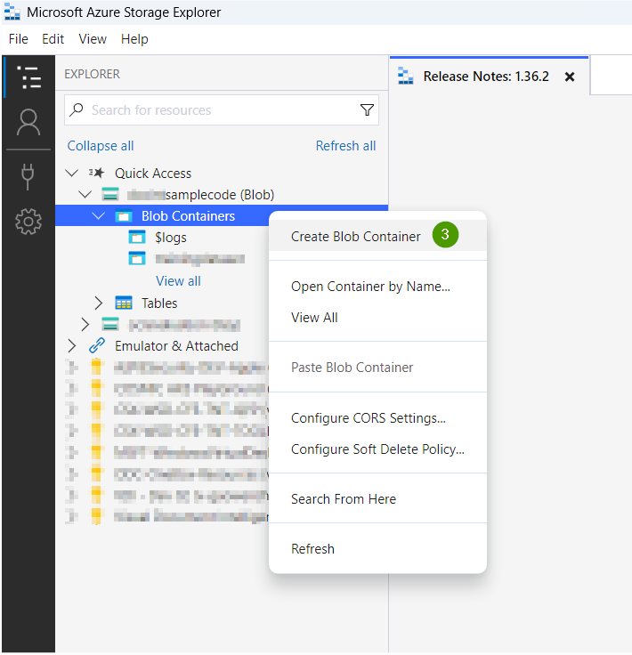
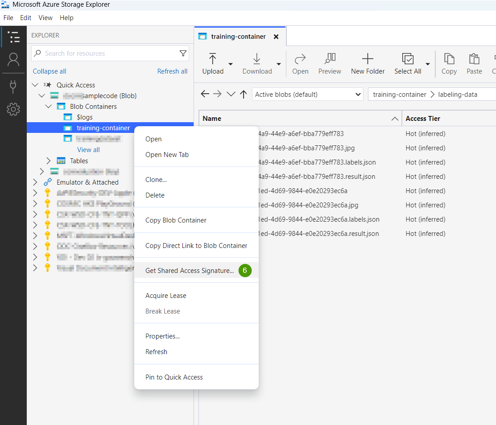
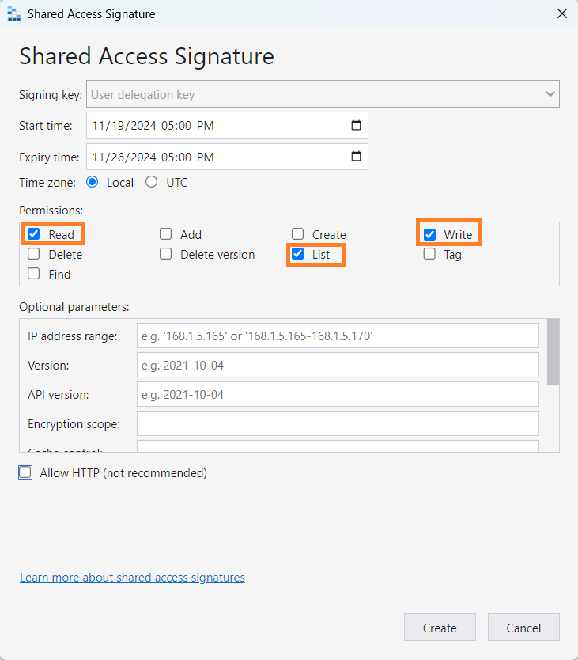
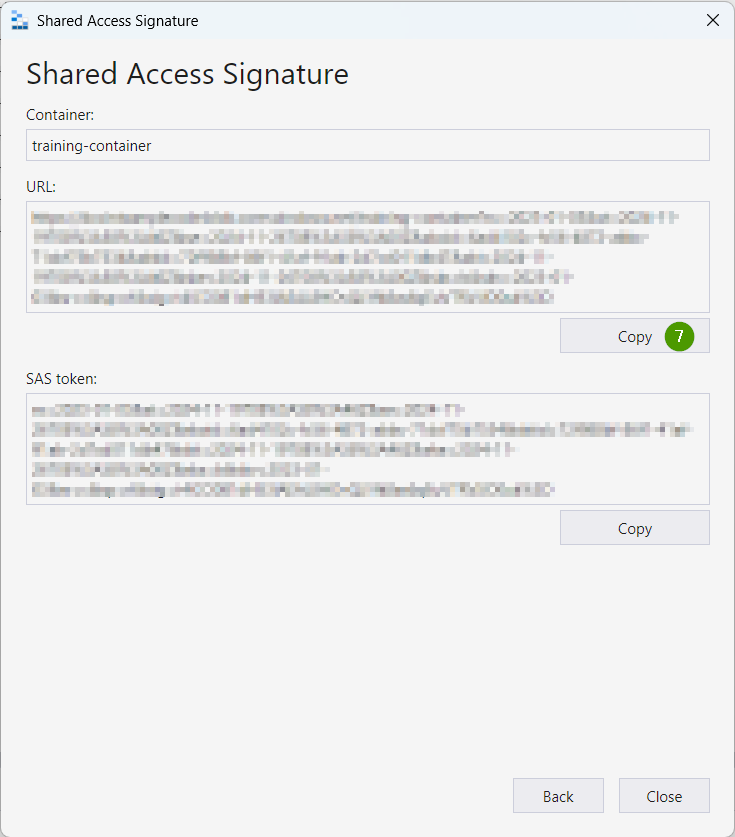

# Set env variables for training data and reference doc for Pro mode
Folders [document_training](../ContentUnderstanding.Common/data/document_training/) and [field_extraction_pro_mode](../ContentUnderstanding.Common/data/field_extraction_pro_mode) contain the manually labeled data for training and reference doc for Pro mode as a quick sample. Before using these knowledge source files, you need an Azure Storage blob container to store them. Let's follow below steps to prepare the data environment:

1. *Create an Azure Storage Account:* If you don’t already have one, follow the guide to [create an Azure Storage Account](https://aka.ms/create-a-storage-account).
    > If you already have an account, you can skip this step.
2. *Install Azure Storage Explorer:* Azure Storage Explorer is a tool which makes it easy to work with Azure Storage data. Install it and login with your credential, follow the [guide](https://aka.ms/download-and-install-Azure-Storage-Explorer).
3. *Create or Choose a Blob Container:* Create a blob container from Azure Storage Explorer or use an existing one.  
     
4. *Generate a Shared Access Signature (SAS) URL:*
    - Right-click on blob container and select the `Get Shared Access Signature...` in the menu.
    - Check the required permissions: `Read`, `Write` and `List`
    - Click the `Create` button.  
       
5. *Copy the SAS URL:* After creating the SAS, click `Copy` to get the URL with token. This will be used as the value for **TrainingDataSasUrl** or **ReferenceDocSasUrl** when running the sample code.  
     
6. *Set Environment Variables in "Program.cs" File:* Depending on the sample that you will run, you will need to set required environment variables. In the C# version, these variables are configured through Console.ReadLine() prompts in the Program.cs file, where you'll be asked to input the necessary values interactively at runtime.
    > NOTE: **ReferenceDocSasUrl** can be the same as the **TrainingDataSasUrl** to re-use the same blob container
    - [AnalyzerTraining](../AnalyzerTraining/Program.cs): Add the SAS URL as value of **TrainingDataSasUrl**, and a prefix for **TrainingDataPath**. You can choose any folder name you like for **TrainingDataPath**. For example, you could use "training_files".
        ```env
        TrainingDataSasUrl=<Blob container SAS URL>
        TrainingDataPath=<Designated folder path under the blob container>
        ```
    - [FieldExtractionProMode](../FieldExtractionProMode/Program.cs): Add the SAS URL as value of **ReferenceDocSasUrl**, and a prefix for **ReferenceDocPath**. You can choose any folder name you like for **ReferenceDocPath**. For example, you could use "reference_docs".
        ```env
        ReferenceDocSasUrl=<Blob container SAS URL>
        ReferenceDocPath=<Designated folder path under the blob container>
        ```

Now, we have completed the preparation of the data environment. Next, we could create an analyzer through code.

   
